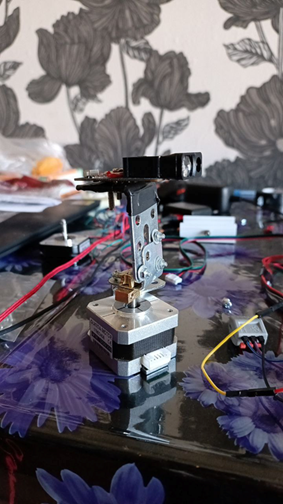
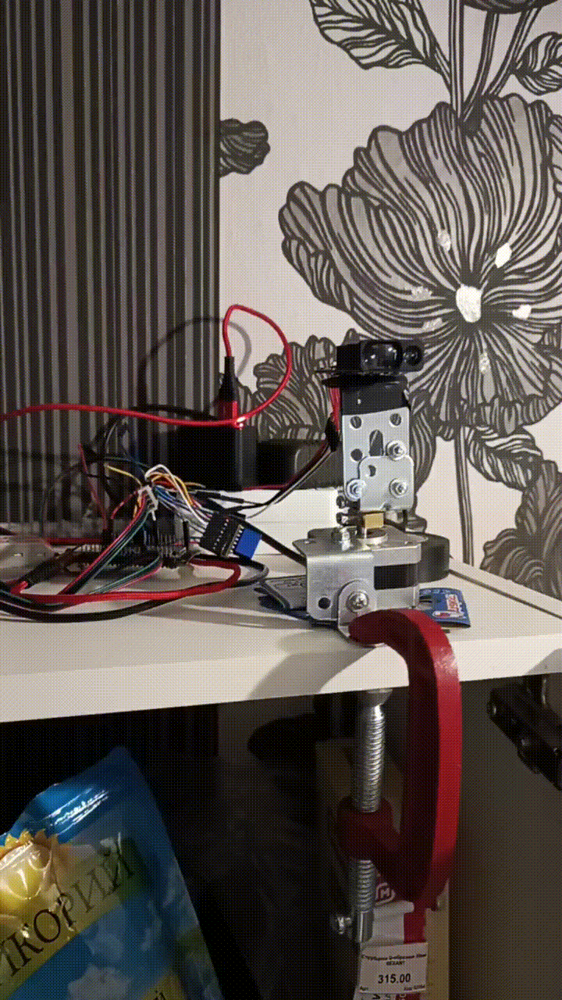

# Эксперимент «Лазерный сканер»

## Краткое описание

Данный эксперимент посвящён проверке работоспособности и общей стабильности лазерного сканера, реализованного на базе шагового двигателя. Основное внимание уделялось выявлению факторов, влияющих на точность позиционирования при длительной работе системы.

## Общие условия

* Длительность эксперимента: **19 часов**
* Тип привода: шаговый двигатель
* Конструкция носила **экспериментальный характер** и включала временные механические элементы

## Общие наблюдения

* Точность позиционирования чувствительна к **механическому люфту** двигателя и элементов крепления.
* Наибольшие ошибки проявляются при **малых углах поворота**.
* Механическая жёсткость конструкции существенно влияет на повторяемость результата.
  

## Заключение

Эксперимент подтвердил необходимость повышения жёсткости механической части и более аккуратного подхода к соединению двигателя с остальными элементами системы при разработке лазерного сканера.

## Примечания

* Не рекомендуется прямое жёсткое соединение платы с валом шагового двигателя.
* Требуется внимательная проверка электрических соединений, особенно линии **GND**.
* Важно учитывать рабочее напряжение шагового двигателя для сохранения удерживающего момента.

---

README носит ознакомительный характер и предназначен для общего понимания сути проведённого эксперимента.
